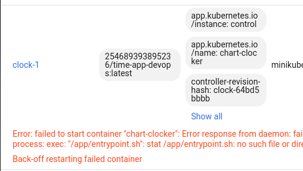
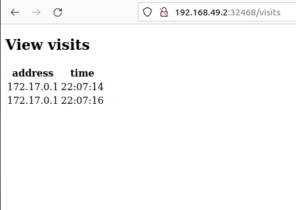
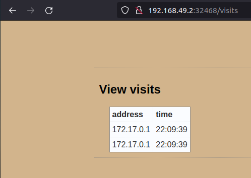

# lab 13

I renamed `deployment.yaml` to `statefulset.yaml`

Next I typed this command: `helm install --dry-run --debug control chart-clocker`

I get next output:
```
$ helm install --dry-run --debug control chart-clocker
install.go:192: [debug] Original chart version: ""
install.go:209: [debug] CHART PATH: /home/amir/PycharmProjects/devops-labs/k8s/chart-clocker

NAME: control
LAST DEPLOYED: Tue Nov 29 20:05:04 2022
NAMESPACE: default
STATUS: pending-install
REVISION: 1
USER-SUPPLIED VALUES:
{}

COMPUTED VALUES:
affinity: {}
autoscaling:
  enabled: false
  maxReplicas: 100
  minReplicas: 1
  targetCPUUtilizationPercentage: 80
fullnameOverride: clock
healthcheck:
  enabled: false
image:
  pullPolicy: Always
  repository: 254689393895236/time-app-devops
  tag: latest
imagePullSecrets: []
ingress:
  annotations: {}
  className: ""
  enabled: false
  hosts:
  - host: chart-example.local
    paths:
    - path: /
      pathType: ImplementationSpecific
  tls: []
mountVisits:
  enabled: false
nameOverride: ""
nodeSelector: {}
podAnnotations: {}
podSecurityContext: {}
replicaCount: 3
resources: {}
securityContext: {}
service:
  port: 80
  type: LoadBalancer
serviceAccount:
  annotations: {}
  create: true
  name: clock
tolerations: []

HOOKS:
---
# Source: chart-clocker/templates/tests/test-connection.yaml
apiVersion: v1
kind: Pod
metadata:
  name: "clock-test-connection"
  labels:
    helm.sh/chart: chart-clocker-0.1.0
    app.kubernetes.io/name: chart-clocker
    app.kubernetes.io/instance: control
    app.kubernetes.io/version: "1.16.0"
    app.kubernetes.io/managed-by: Helm
  annotations:
    "helm.sh/hook": test
spec:
  containers:
    - name: wget
      image: busybox
      command: ['wget']
      args: ['clock:80']
  restartPolicy: Never
MANIFEST:
---
# Source: chart-clocker/templates/serviceaccount.yaml
apiVersion: v1
kind: ServiceAccount
metadata:
  name: clock
  labels:
    helm.sh/chart: chart-clocker-0.1.0
    app.kubernetes.io/name: chart-clocker
    app.kubernetes.io/instance: control
    app.kubernetes.io/version: "1.16.0"
    app.kubernetes.io/managed-by: Helm
---
# Source: chart-clocker/templates/secrets.yaml
apiVersion: v1
kind: Secret
metadata:
  name: beautiful
  namespace: default
data:
  token: SnVsaTNEb2UzTm90
type: Opaque
---
# Source: chart-clocker/templates/configmap.yaml
apiVersion: v1
kind: ConfigMap
metadata:
  name: some-config
data:
  config.json: |-
---
# Source: chart-clocker/templates/service.yaml
apiVersion: v1
kind: Service
metadata:
  name: clock
  labels:
    helm.sh/chart: chart-clocker-0.1.0
    app.kubernetes.io/name: chart-clocker
    app.kubernetes.io/instance: control
    app.kubernetes.io/version: "1.16.0"
    app.kubernetes.io/managed-by: Helm
spec:
  type: LoadBalancer
  ports:
    - port: 80
      targetPort: http
      protocol: TCP
      name: http
  selector:
    app.kubernetes.io/name: chart-clocker
    app.kubernetes.io/instance: control
---
# Source: chart-clocker/templates/statefulset.yaml
apiVersion: apps/v1
kind: StatefulSet
metadata:
  name: clock
  labels:
    helm.sh/chart: chart-clocker-0.1.0
    app.kubernetes.io/name: chart-clocker
    app.kubernetes.io/instance: control
    app.kubernetes.io/version: "1.16.0"
    app.kubernetes.io/managed-by: Helm
spec:
  podManagementPolicy: "Parallel"
  replicas: 3
  selector:
    matchLabels:
      app.kubernetes.io/name: chart-clocker
      app.kubernetes.io/instance: control
  template:
    metadata:
      labels:
        app.kubernetes.io/name: chart-clocker
        app.kubernetes.io/instance: control
    spec:
      serviceAccountName: clock
      securityContext:
        {}
      containers:
        - name: chart-clocker
          securityContext:
            {}
          image: "254689393895236/time-app-devops:latest"
          imagePullPolicy: Always
          volumeMounts:
            - name: configi
              mountPath: /app/config.json
              subPath: config.json
          env:
            - name: TOKEN
              valueFrom:
                secretKeyRef:
                  name: beautiful
                  key: token
          resources:
            requests:
              memory: "64M"
              cpu: "100m"
            limits:
              memory: "256M"
              cpu: "200m"
          ports:
            - name: http
              containerPort: 5000
              protocol: TCP

      volumes:
        - name: configi
          configMap:
            name: some-config

NOTES:
1. Get the application URL by running these commands:
     NOTE: It may take a few minutes for the LoadBalancer IP to be available.
           You can watch the status of by running 'kubectl get --namespace default svc -w clock'
  export SERVICE_IP=$(kubectl get svc --namespace default clock --template "{{ range (index .status.loadBalancer.ingress 0) }}{{.}}{{ end }}")
  echo http://$SERVICE_IP:80
```

I moved these variables to values to configure environment:
```
mountVisits:
  enabled: false

healthcheck:
  enabled: false
```

`mountVisits` is used to mount volume (look at `statefulset.yaml`)

```
$ kubectl get po,sts,svc,pvc
NAME          READY   STATUS              RESTARTS      AGE
pod/clock-0   0/1     CrashLoopBackOff    4 (40s ago)   2m46s
pod/clock-1   0/1     RunContainerError   4 (9s ago)    2m46s
pod/clock-2   0/1     CrashLoopBackOff    4 (20s ago)   2m46s

NAME                     READY   AGE
statefulset.apps/clock   0/3     2m46s

NAME                 TYPE           CLUSTER-IP       EXTERNAL-IP   PORT(S)          AGE
service/clock        LoadBalancer   10.99.196.251    <pending>     80:32468/TCP     2m47s
service/clocker      LoadBalancer   10.109.126.103   <pending>     5000:32188/TCP   10d
service/exposer      LoadBalancer   10.110.54.193    <pending>     80:30827/TCP     10d
service/kubernetes   ClusterIP      10.96.0.1        <none>        443/TCP          10d
```

problem with docker image


I made fixes on Dockerfile (I oversimplified file, but after I understood the issue, however I did not change the file)
```
$ kubectl get po,sts,svc,pvc
NAME          READY   STATUS    RESTARTS   AGE
pod/clock-0   1/1     Running   0          64s
pod/clock-1   1/1     Running   0          64s
pod/clock-2   1/1     Running   0          64s

NAME                     READY   AGE
statefulset.apps/clock   3/3     64s

NAME                 TYPE           CLUSTER-IP       EXTERNAL-IP   PORT(S)          AGE
service/clock        LoadBalancer   10.99.196.251    <pending>     80:32468/TCP     59m
service/clocker      LoadBalancer   10.109.126.103   <pending>     5000:32188/TCP   10d
service/exposer      LoadBalancer   10.110.54.193    <pending>     80:30827/TCP     10d
service/kubernetes   ClusterIP      10.96.0.1        <none>        443/TCP          10d
```

Then I accessed the service with
```
$ minikube service list
|----------------------|---------------------------|--------------|---------------------------|
|      NAMESPACE       |           NAME            | TARGET PORT  |            URL            |
|----------------------|---------------------------|--------------|---------------------------|
| default              | clock                     | http/80      | http://192.168.49.2:32468 |
| default              | clocker                   |         5000 | http://192.168.49.2:32188 |
| default              | exposer                   |           80 | http://192.168.49.2:30827 |
| default              | kubernetes                | No node port |
```

it did not worked first (since visits mount was disabled), but after fix


two photos have different log for visits (since they accessed from diff 'endpoints')

```
$ kubectl exec clock-1 -- cat visits/visit.txt
172.17.0.1 22:07:14
172.17.0.1 22:07:16
172.17.0.1 22:09:38
172.17.0.1 22:09:39

$ kubectl exec clock-0 -- cat visits/visit.txt
172.17.0.1 22:07:16
172.17.0.1 22:09:36

$ kubectl exec clock-2 -- cat visits/visit.txt
172.17.0.1 22:09:39
172.17.0.1 22:09:39
```
Such results are obtained since first pod was not
busy too much (only one user accessed the application),
however after another user joined, load balancer started
to transmit users between these pods. Since the first pod was
first one to take guest, he has more visits.

Next question about ordering guarantee. Since my app
does not have any business goal, it is not important. Also,
if I wanted to know from which browsers clients access my website,
ordering guarantee is not important since I can merge all logs.

For parallel work I added next line to `statefulset.yaml`
to control via values:

```
{{- if .Values.turnParallel.enabled }}
  podManagementPolicy: "Parallel"
{{- end }}
```

```
$ kubectl get po
NAME                      READY   STATUS        RESTARTS   AGE
clock-0                   1/1     Terminating   0          12m
clock-1                   1/1     Terminating   0          11m
clock-2                   1/1     Terminating   0          11m
control-chart-clocker-0   1/1     Running       0          42s
control-chart-clocker-1   1/1     Running       0          42s
control-chart-clocker-2   1/1     Running       0          42s
```

```
$ kubectl exec control-chart-clocker-0  -- cat visits/visit.txt
172.17.0.1 22:35:24
172.17.0.1 22:35:52
172.17.0.1 22:35:57
$ kubectl exec control-chart-clocker-1  -- cat visits/visit.txt
172.17.0.1 22:35:23
172.17.0.1 22:35:24
172.17.0.1 22:35:56
$ kubectl exec control-chart-clocker-2  -- cat visits/visit.txt
172.17.0.1 22:35:22
172.17.0.1 22:35:25
172.17.0.1 22:35:55
```